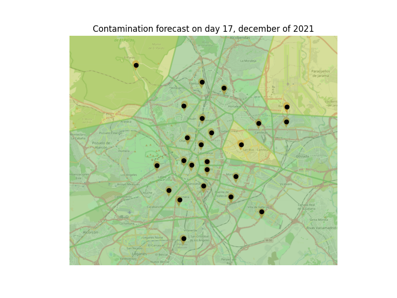

# Air Quality Predictor
Air quality predictor is an application that predicts the air quality of the city of Madrid. 
This application takes data given by the council of Madrid for predicting the pollution levels across different 
districts of the city. This application takes n-triples / turtle encoded data obtained by cleaning and transforming the 
data sources, to later predict the level of pollution on a given day. Then it categorizes the level of pollution by 
using an air quality index known as CAQI. 

 
_Source:_ [Wikipedia](https://en.wikipedia.org/wiki/Air_quality_index#Europe).

At the end, the application will return an image that describes the level of 
pollution across the city by coloring a city map following the color code given by the air quality index mentioned 
before.


## Install dependencies

```
pip install -r requirements.txt
```

## Run the application

**Windows:**
```
air_quality_predictor.py
```

**Linux:**
```
python3 air_quality_predictor.py
```

## Example

```
  [OK] Libraries imported.


              _                              _  _  _                                  _  _        _               
       /\    (_)                            | |(_)| |                                | |(_)      | |              
      /  \    _  _ __    __ _  _   _   __ _ | | _ | |_  _   _   _ __   _ __  ___   __| | _   ___ | |_  ___   _ __ 
     / /\ \  | || '__|  / _` || | | | / _` || || || __|| | | | | '_ \ | '__|/ _ \ / _` || | / __|| __|/ _ \ | '__|
    / ____ \ | || |    | (_| || |_| || (_| || || || |_ | |_| | | |_) || |  |  __/| (_| || || (__ | |_| (_) || |   
   /_/    \_\|_||_|     \__, | \__,_| \__,_||_||_| \__| \__, | | .__/ |_|   \___| \__,_||_| \___| \__|\___/ |_|   
                           | |                           __/ | | |                                                V1.0
                           |_|                          |___/  |_|                                                

  Welcome to Air quality predictor!
  Wait until the program initializes, please.

  [INFO] Importing libraries...
  [OK] Libraries imported.
  [INFO] Importing data...
  [OK] Data imported.
  Please, now select the day of december you want to now about> 17
```

The application will show you the predicted air quality of the city of Madrid at the selected day, in this case 
December 17th:
